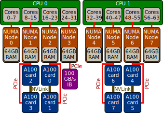

# Understanding the AccelerateAI architecture

AccelerateAI comprises six BullSequana X410-A5 nodes, connected to each other (and to the Supercomputing Wales SUNBIRD hardware) via NVIDIA Networking Infiniband EDR. Within each node is:

* 2 x AMD EPYC Rome 7452 32-core CPUs
* 8 x NVIDIA A100 PCIe 40GB GPUs
  * 4 x NVIDIA NVLink bridges between pairs of GPUs
* 512GB RAM
* 1 x NVIDIA Networking Infiniband EDR 100GB/s link

## Node structure

Each CPU has four "chiplets" inside, each with eight cores and a dedicated NUMA node with 64GB of RAM. Each GPU, and the Infiniband adapter, are also associated with one of the eight NUMA nodes. Pairs of GPUs are located on the same NUMA node, and these pairs are also linked together with NVLink for higher-speed transfers.

This high-level structure is illustrated in the diagram below:

Consequences of this structure:

* When using a GPU, processes should be pinned to CPU cores attached to the same NUMA node.
* When using multiple GPUs, they should be on the same NUMA node and attached via NVLink.
* Using more than two GPUs will send data via the PCIe bus. This should be tested to ensure that it does indeed improve the performance over using two cards.
* Half of the CPU cores are not directly connected to GPUs. They can be left idle, or can be grouped together with the adjacent node that has a GPU attached.
  * For example, a process using GPUs 0 and 1 could be pinned to cores 16&ndash;31.
* When parallelising across multiple nodes, processes on GPUs 0&ndash3 will get quicker access to the network than those on GPUs 4&ndash;7.
* As a result of the above, by default you are restricted from submitting jobs that will use more than four GPUs or one node. If you think you would benefit from scaling jobs across larger numbers of GPUs, please talk to [SA2C support](sa2csupport), and the RSE team will work with you to verify that your code will scale efficiently._

## Interactive/testing node

One node is reserved for interactive usage on test problems. To maximise availability, since test jobs will use less GPU memory, each A100 in this node is split as follows:

* Three 10GB virtual GPUs
* One 5GB virtual GPU

These are not intended to be used in parallel.

[sa2csupport]: mailto:sa2c-support@swansea.ac.uk
